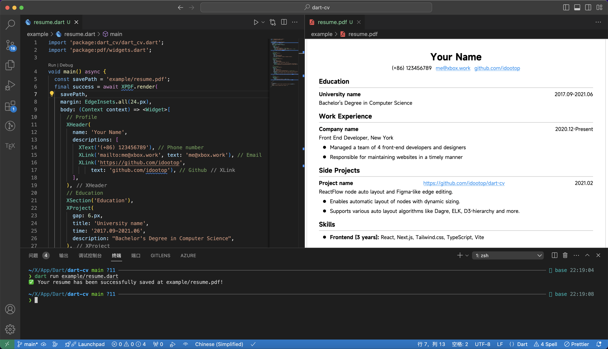

# 🪪 Dart CV

Create professional profile resumes using Flutter Widgets.



## Get Started

1. Clone this repository

```shell
git clone https://github.com/idootop/dart-cv.git
cd resume_flutter
```

2. Install dependencies

Ensure that you have set up the [Dart](https://dart.dev/) environment before running this project.

```shell
dart pub get
```

3. Edit your resume

Open and edit your resume in the `example/dart_cv.dart` file.

```dart
import 'package:dart_cv/dart_cv.dart';
import 'package:pdf/widgets.dart';

void main() async {
  await XPDF.render(
    'example/resume.pdf',
    margin: EdgeInsets.all(24.px),
    body: (Context context) => <Widget>[
      // Profile
      XHeader(
        name: 'Your Name',
        descriptions: [
          XText('(+86) 123456789'), // Phone number
          XLink('mailto:me@xbox.work', text: 'me@xbox.work'), // Email
          XLink('https://github.com/idootop',
              text: 'github.com/idootop'), // Github
        ],
      ),
      // ...
    ],
  );
}
```

4. Build your resume

```dart
dart run example/resume.dart
```

The PDF file will be exported at `example/resume.pdf`.
